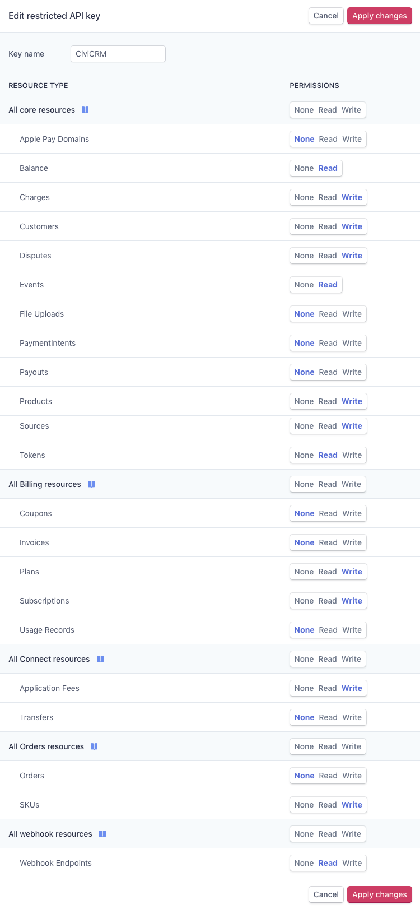

# Install / Configuration
Please do help improve this documentation by submitting a PR or contacting me.

## Configuration

### Stripe
Create an API key by logging in to your Stripe dashboard and selecting [API keys](https://dashboard.stripe.com/account/apikeys) from the left navigation.  You can use the standard key, or you can click "Create restricted key" to have a more limited key.  Example key restrictions are listed below.

### CiviCRM
All configuration is in the standard Payment Processors settings area in CiviCRM admin (**Administer menu » System Settings » Payment Processors**).
Add a payment processor and enter your "Publishable" & "Secret" keys given by stripe.com.  

## Installation
There are no special installation requirements.
The extension will show up in the extensions browser for automated installation.
Otherwise, download and install as you would for any other CiviCRM extension.

### How to update Stripe API version
More info on how to change:  https://stripe.com/docs/upgrades#how-can-i-upgrade-my-api

Go to _Account Settings_ -> _API Keys_ tab -> click _Upgrade available_ button.

Don't forget to update the webhook API version as well.

### Stripe API Key restrictions
If you prefer, you can restrict the permissions available to the API key you create.  The below is an example that may have more permissions than is needed, but works with one-time payments, recurring payments, and the webhook check built into this extension.  If a permission isn't listed below, leave it as *None*.

**Core resources**  
Balance: *Read*  
Charges: *Write*  
Customers: *Write*  
Disputes: *Write*  
Events: *Read*  
Products: *Write*  
Sources: *Write*  
Tokens: *Read*  
**Billing resources**  
Plans: *Write*  
Subscriptions: *Write*  
**Connect resources**  
Application Fees: *Write*  
**Orders resources**  
SKUs: *Write*  
**Webhook resources**  
Webhook Endpoints: *Write* (required for the webhook system check/auto-create webhooks)  

